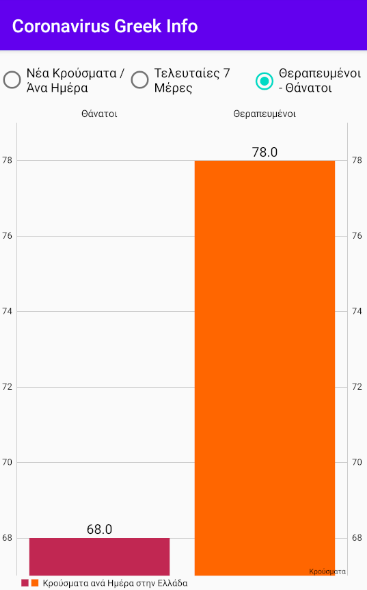

# CoronaVirus-Greek-Info
CoronaVirus Greek Info is an application that helps facilitate the Greek citizen by automatically sending a message to 13033 in order to get permission to be able to do their work as long as the quarantine lasts. Also through the application the Greek citizen is informed daily for the new cases in Greece from the following categories that the application has (New cases Per day/Last 7 Days, Total Cases Last 7 Days in Greece , Recovered Cases / Deaths).

**#The application uploaded on Google Play but is pending for publication. (But if you want you can dowlonad my [apk](https://gofile.io/?c=IEA4xb) Here)**
                                                                            
### How To Use This

1. Clone or download github project
2. Extract it
3. Open it in Android Studio. File >> Open
4. Build >> Build Apk(s)

### Development
If you want to work on this application we’d love your pull requests and tickets on GitHub!

1.If you open up a ticket, please make sure it describes the problem or feature request fully.
## 

      
